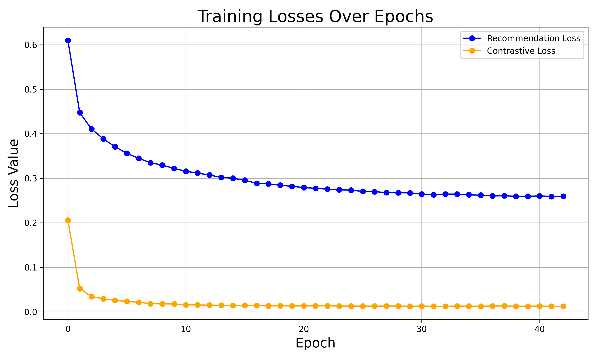
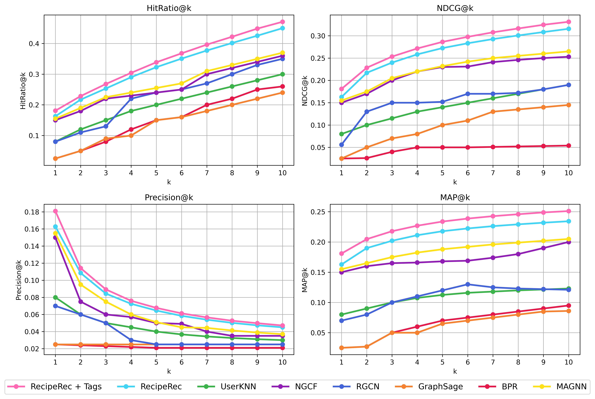

# RecipeRec Enhancement Project

**Group ID:** G049  
**Student Numbers:** s2086929, s2711982, s2719295  
**Course:** Machine Learning Practical (MLP) Coursework 4  
**Date:** March 27, 2025

## Project Overview

This project enhances a state-of-the-art recipe recommendation system, RecipeRec [1], by augmenting its User-Recipe-Ingredient (URI) Graph with recipe tags and nutritional data. RecipeRec leverages a heterogeneous graph neural network (GNN) with hierarchical attention, an ingredient set transformer, and contrastive learning for personalized recipe recommendations. However, its original URI-Graph lacks semantic tags (e.g., cuisine types) and detailed nutritional context, potentially limiting its personalization capabilities. We aimed to address these gaps by answering two research questions:

1. **RQ1:** Does adding tag nodes improve user preference modeling via enriched graph structure?
2. **RQ2:** Does integrating nutritional data enhance personalization in recipe embeddings?

We extended the URI-Graph dataset (7,958 users, 68,794 recipes, 8,847 ingredients) with ~500 tag nodes and 500,000 recipe-tag edges from Food.com, plus six nutritional features (calories, total fat, sugar, sodium, protein, saturated fat) from the USDA database, increasing recipe embeddings from 1024D to 1030D. We compared our enhanced model (RecipeRec + Tags) against baselines including UserKNN, BPR, NGCF, GraphSage, RGCN, MAGNN, and the original RecipeRec.

## Results

Our augmented model, RecipeRec + Tags, significantly outperforms the original RecipeRec and all baselines across key metrics:

- **HitRate@10:** 0.471 (vs. 0.449 for RecipeRec, a **4.90\% increase**)
- **NDCG@10:** 0.331 (vs. 0.316 for RecipeRec, a **4.75\% increase**)
- **Precision@10:** 0.0471 (vs. 0.0450)
- **MAP@10:** 0.2511 (vs. 0.2343)

These gains validate that tag nodes (RQ1) enhance relational modeling via HGAT, and nutritional data (RQ2) improves personalization through richer embeddings refined by the set transformer. The performance trends are visualized in the figures below.

### Figures

- **`training_losses.png`**: Training loss curves for RecipeRec + Tags, showing recommendation and contrastive loss convergence over 50 epochs.
  

- **`top_k_recipe_recommendation.png`**: Performance comparison across top-\( K \) metrics (1 to 10) for all models, highlighting RecipeRec + Tags’ superiority.
  

## Key Findings

- **RQ1**: Adding ~500 tag nodes and 500,000 edges enriches the graph structure, boosting recommendation accuracy (e.g., +4.90\% HitRate@10).
- **RQ2**: Nutritional features in 1030D embeddings enhance personalization, improving ranking quality (e.g., +4.75\% NDCG@10).
- **Comparison**: RecipeRec + Tags outperforms baselines like MAGNN (Hit@10 = 0.370, NDCG@10 = 0.265) and NGCF (Hit@10 = 0.360, NDCG@10 = 0.253), underscoring the value of domain-specific augmentations.

## References

[1] Tian, Y., et al. "RecipeRec: A Heterogeneous Graph Learning Model for Recipe Recommendation." *Frontiers in Big Data*, 2022.

---
